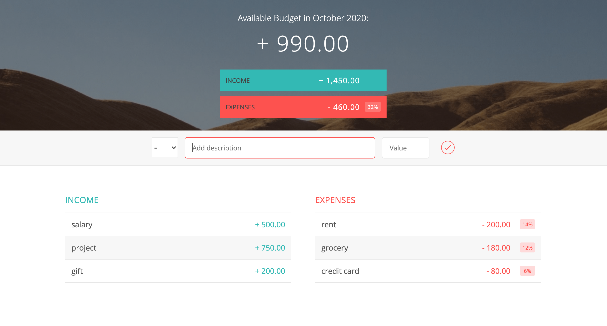

Веб-приложение, которое позволяет вести личный бюджет на ежемесячной основе. 

Построен на основе модулей IIFE, которые можно условно разделить на 3 части: UI Controller, Budget Controller, Global Controller.

Минималистичный UI, который позволяет вывести чистый месячный бюджет, а также показывает совокупный доход и расход, структуру расходов.

